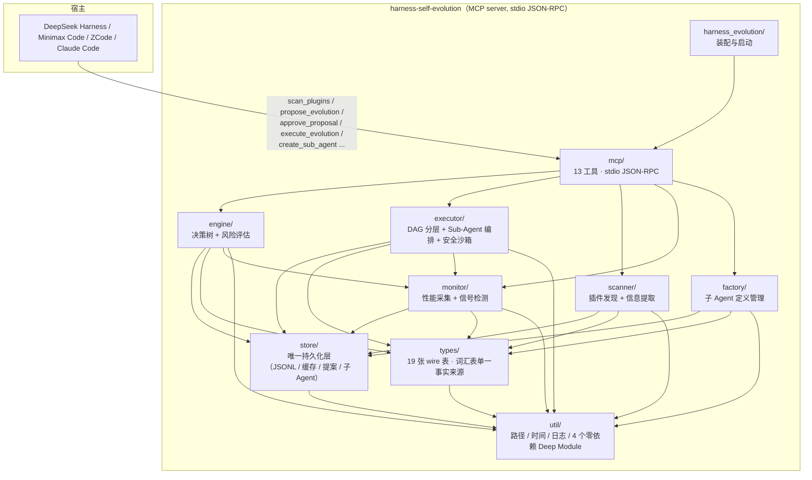
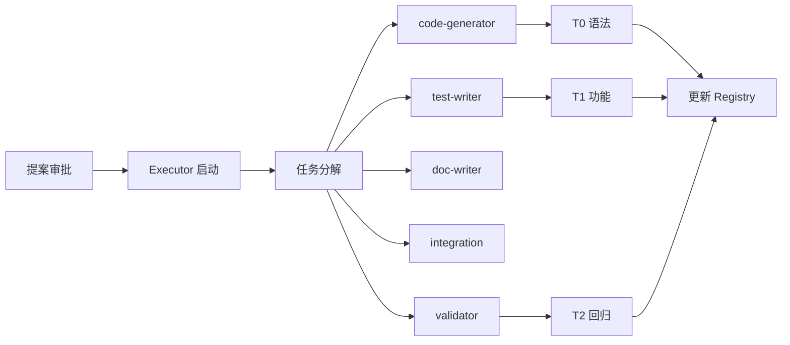

# Harness Self-Evolution Plugin

> 让多种 Harness 平台的插件生态持续自我进化 —— 扫描 → 监控 → 识别 → 提案 → 人工审批 → 真实升级。
>
> 支持：DeepSeek Harness（首打）/ Minimax Code / ZCode / Claude Code / OpenClaw

[](LICENSE)
[](.zcode-plugin/plugin.json)
[](moon.mod)
[](CONTEXT.md)[](#安全沙箱)
[](build.ps1)
[]()

[English](#english) · [中文](#中文)

---

## 目录

- [一句话定位](#一句话定位)
- [特性](#特性)
- [兼容性](#兼容性)
- [架构](#架构)
- [安装](#安装)
- [快速开始](#快速开始)
- [配置](#配置)
- [MCP 工具](#mcp-工具)
- [项目结构](#项目结构)
- [子 Agent 系统](#子-agent-系统)
- [数据存储](#数据存储)
- [架构守卫](#架构守卫)
- [风险缓解](#风险缓解)
- [文档](#文档)
- [贡献](#贡献)
- [许可证](#许可证)

---

## 中文

### 一句话定位

挂在多种 Harness 平台上的自进化插件（首打 DeepSeek Harness）。用户全程只介入一处：看提案，点同意或不同意。

### 特性

- **插件扫描**：解析 `plugin.json` / `SKILL.md`，评复杂度、接口清晰度、文档质量
- **指标采集**：按调用记录延迟、成功率、Token 开销；热路径不读盘，深度检查按节流间隔
- **信号识别**：强信号（用户纠正 / 连续失败 ≥ 3 / 指标下滑 > 20%）立即触发；中信号累积；弱信号只记录
- **提案生成**：八类进化提案绑定 Matt Pocock 工程原则；24 小时冷却、每会话上限 3 条、重复丢弃
- **执行验证**：状态机 `pending → approved → executing → completed`，非 `approved` 拒绝执行
- **子 Agent 工厂**：3 个 MCP 工具管理两个作用域的 Markdown + YAML frontmatter 定义文件
- **DSH 集成**：与 DeepSeek Harness 的 `subagent` 工具对接，支持任务 DAG 编排
- **DSH Watcher 集成**：可选的只读会话观察插件，可视化进化执行过程、模型推理时间和工具调用链路
- **学术写作进化**：支持学术写作规范化、反 AI 写作检测、引用规范化三类进化，基于 AI 痕迹检测和学术规范检查
- **安全沙箱**：executor 写操作前置防护 — 6 类敏感数据扫描（API Key/Token/Password/PrivateKey/EnvAssignment/AuthHeader）、路径边界检查、文件级自动备份与回滚；所有 I/O 沉淀到 `store/sandbox_store.mbt`，满足架构守卫 G3

### DSH 生态提报证据（L1–L3）

> **L1 仓库**：https://github.com/Across2005/harness-self-evolution-plugin（GitHub）/ https://www.gitlink.org.cn/Across2005/harness-self-evolution-plugin（GitLink 镜像）— 公开，2026-09-09 发布 v2.4.0，MoonBit native，MIT。
>
> **L2 manifest**：`package.json` 声明 `dsh.bundle`（指向 `.zcode-plugin/plugin.json`），同时为 5 个宿主（DeepSeek Harness / Minimax Code / ZCode / Claude Code / OpenClaw）各有一份 capability 投影。13 个 MCP 工具 + DSH subagent 三件套（`get_execution_plan` / `report_task_result` / `finalize_execution`）。377 测试全过（0 失败）、11 条架构守卫 G1–G6 机器化卡死。
>
> **L3 安装规范**：
> ```bash
> dsh plugin --profile web add "github:Across2005/harness-self-evolution-plugin#v2.4.0"
> ```
> 数据存 `~/.harness-evolution/v2/`（可由 `$HARNESS_EVOLUTION_HOME` 覆盖），配置源链 `$HARNESS_EVOLUTION_CONFIG` → `/.zcode-plugin/plugin.json` → 内置默认。

### 平台兼容性

> **v2.4.0 产物为 Windows native**（`bin/harness-evolution.exe`，1,293,824 B）。Linux/macOS 沙盒首次安装可能需要 `allowBuilds` 显式放行。跨平台分发是 v2.5 路线图项，详见 [`ROADMAP.md`](ROADMAP.md)。

### 已知限制

- **F5 — `intensity=50` 时手动信号不触发提案**：`propose_evolution` 的 `signals` 参数按设计是 medium 强度，默认 50% 只放行 strong。要把手动信号生效需将 `intensity` 设为 `"100%"`。
- **`record_tool_call` / `record_user_feedback` 暂无生产调用方**：这两个 MCP 工具在本仓库里没有生产路径上的调用方（1.0 也一样）。可走手动路径，但自动信号需 Harness 侧注入事件（注入点已就绪，待平台回调）。
- **自动审批故意不接通**：`auto_approve` 字段在 2.0 起遇 `true` 显式告警并回落 `false` —— 人工审批是「自动改代码失控」的唯一闸门。

### 兼容性

本插件兼容多种 Harness 平台：

| 平台 | 宿主标识 | 插件目录 | 子 Agent 目录 |
|------|----------|----------|---------------|
| **DeepSeek Harness** | `deepseek-harness` | `~/.deepseek/harness/plugins/`, `~/.deepseek/harness/extensions/` | `~/.deepseek/harness/agents/` |
| **Minimax Code** | `minimax-code` | `~/.minimax/plugins/`, `~/.minimax/extensions/` | `~/.minimax/agents/` |
| **ZCode** | `zcode` | `~/.zcode/cli/plugins/`, `~/.zcode/skills/` | `~/.zcode/agents/` |
| **Claude Code** | — | 作为 MCP 服务器调用 | — |
| **OpenClaw** | — | 作为 MCP 服务器调用 | — |

可通过环境变量 `HARNESS_EVOLUTION_HOST` 切换宿主类型。

### 架构



依赖图是**严格分层**的（`util → types → store → scanner/monitor → engine/executor/factory → mcp → harness_evolution`），由 `src/mcp/architecture_test.mbt` 的 11 条守卫（G1–G6）机器化验证；任何新增反向边、往 stdout 写日志、绕过 `store/` 持久化，都会在 `moon test` 里立刻变红。

### 安装

#### 前置要求

- **MoonBit 工具链**（`moon`）：从 [MoonBit 官网](https://www.moonbitlang.com/) 下载安装
- **Windows**：Visual Studio 的 C++ 生成工具（`cl.exe`）+ Windows SDK（`build.ps1` 会自动探测）
- **宿主环境**（任选其一）：
  - DeepSeek Harness
  - Minimax Code CLI：`npm install -g mmx-cli`
  - ZCode CLI
  - Claude Code / OpenClaw（作为 MCP 服务器）

运行时**不需要 Node.js** —— 产物是独立的 native 可执行文件。

#### 构建

```powershell
# 克隆（任选一）
git clone https://github.com/Across2005/harness-self-evolution-plugin.git
# 或
git clone https://www.gitlink.org.cn/Across2005/harness-self-evolution-plugin.git

cd harness-self-evolution-plugin

# 构建：check + test + build，产物复制到 bin\harness-evolution.exe
.\build.ps1 all

# 链接到 ZCode（可选）
zcode plugin link .
```

> **为什么锁死 `async@0.20.1`**：0.21.x 开始使用 `noraise + nocancel` 效果注解语法，而当前工具链（moon 0.1.20260819）解析它会报 `[3002] Parse error, unexpected token '+'`。升级到能解析该语法的 moon 版本后方可放开约束。

### 快速开始

#### 1. 环境准备

确保已安装以下工具：

- **MoonBit 工具链**（`moon`）：从 [MoonBit 官网](https://www.moonbitlang.com/) 下载安装
- **Windows 用户**：Visual Studio 的 C++ 生成工具（`cl.exe`）+ Windows SDK（`build.ps1` 会自动探测）
- **宿主环境**（任选其一）：
  - DeepSeek Harness
  - Minimax Code CLI：`npm install -g mmx-cli`
  - ZCode CLI
  - Claude Code / OpenClaw（作为 MCP 服务器）

#### 2. 获取与构建

```powershell
# 克隆仓库（任选一）
git clone https://github.com/Across2005/harness-self-evolution-plugin.git
cd harness-self-evolution-plugin

# 完整构建（检查 + 测试 + 构建）
.\build.ps1 all
```

构建成功后，产物位于 `bin/harness-evolution.exe`。

#### 3. 链接到宿主（ZCode）

```powershell
# 将插件链接到 ZCode（使宿主能发现并加载插件）
zcode plugin link .
```

#### 4. 启动插件

插件作为 MCP 服务器运行，由宿主自动启动。启动流程：

1. **宿主（ZCode）读取** `.zcode-plugin/plugin.json` 配置
2. **宿主启动** `bin/harness-evolution.exe` 进程
3. **插件通过 stdio JSON-RPC** 与宿主通信
4. **插件自动扫描** 配置的插件目录（`scan_targets`）
5. **监控开始**，记录性能事件和进化信号

#### 5. 验证运行

```powershell
# 检查插件是否正常运行
zcode plugin list
```

应该能看到 `harness-self-evolution (v2.4.0) - Active`。

#### 6. 使用插件功能

通过宿主调用 MCP 工具：

```javascript
// 扫描所有插件
const result = await callMcpTool('scan_plugins', {});

// 获取插件性能指标
const metrics = await callMcpTool('get_plugin_metrics', { plugin_id: 'browser-use-0.4.1' });

// 生成进化提案
const proposal = await callMcpTool('propose_evolution', { plugin_id: 'browser-use-0.4.1' });
```

### `build.ps1` 子命令

| 命令 | 作用 |
|------|------|
| `.\build.ps1 check` | `moon check --deny-warn --target native`（零错零警才算过） |
| `.\build.ps1 test` | `moon test --target native` |
| `.\build.ps1 build` | release 构建 + 复制到 `bin\harness-evolution.exe` |
| `.\build.ps1 fmt` | `moon fmt` |
| `.\build.ps1 all` | 依次执行 check → test → build |

### 配置

配置只来自 `.zcode-plugin/plugin.json` 的 `evolution_config` 段（查找顺序：`$HARNESS_EVOLUTION_CONFIG` → `<cwd>/.zcode-plugin/plugin.json` → 内置默认值）。**`AGENTS.md` 不参与任何配置解析**。

```json
{
  "scan_targets": [
    "~/.deepseek/harness/plugins/",
    "~/.deepseek/harness/extensions/",
    "~/.minimax/plugins/",
    "~/.minimax/extensions/",
    "~/.zcode/cli/plugins/",
    "~/.zcode/skills/"
  ],
  "evolution_config": {
    "intensity": "50%",
    "auto_approve": false,
    "cooldown_hours": 24,
    "max_log_bytes": 33554432,
    "signal_thresholds": {
      "consecutive_failures": 3,
      "loop_detection": 5,
      "latency_regression": 0.2
    }
  }
}
```

#### 配置字段说明

| 字段 | 默认值 | 说明 |
|------|--------|------|
| `intensity` | `"50%"` | `"100%"` 强信号或两个中信号均可触发；`"50%"` 仅强信号触发；`"0%"` 关闭所有进化检查 |
| `auto_approve` | `false` | **故意不接通**。人工审批是「自动改代码失控」的唯一闸门 |
| `cooldown_hours` | `24` | 同一插件两次提案的最短间隔（小时），下界 1 |
| `max_log_bytes` | `33554432` | `metrics.jsonl` / `signals.jsonl` 的保留上限（字节，默认 32 MiB） |
| `signal_thresholds.consecutive_failures` | `3` | 连续失败次数阈值 |
| `signal_thresholds.loop_detection` | `5` | 循环检测次数阈值 |
| `signal_thresholds.latency_regression` | `0.2` | 性能回归比例阈值 |

### MCP 工具

本插件提供 13 个 MCP 工具：

#### 核心工具

| 工具 | 作用 | 版本 |
|------|------|------|
| `scan_plugins` | 扫描所有插件（按 `scan_targets` 段） | v1.0 |
| `get_plugin_metrics` | 获取插件性能指标 | v1.0 |
| `propose_evolution` | 生成进化提案（可带手动 `signals`） | v1.0 |
| `approve_proposal` | 批准提案（必经环节） | v1.0 |
| `reject_proposal` | 拒绝提案 | v1.0 |
| `list_proposals` | 列出所有提案 | v1.0 |
| `execute_evolution` | 执行已批准提案 | v1.0 |

#### 子 Agent 工厂工具

| 工具 | 作用 | 版本 |
|------|------|------|
| `create_sub_agent` | 创建子 Agent 定义文件 | v2.1 |
| `list_sub_agents` | 列出子 Agent 定义（可按 `scope` 过滤） | v2.1 |
| `delete_sub_agent` | 删除子 Agent 定义 | v2.1 |

#### 合并工具

| 工具 | 作用 | 版本 |
|------|------|------|
| `analyze_plugins` | 合并工具：扫描并/或获取指标（`mode=scan/metrics/both`） | v2.3 |
| `evolve_plugin` | 合并工具：生成或执行提案（`action=propose/execute`） | v2.3 |
| `manage_sub_agent` | 合并工具：管理子 Agent 定义（`action=create/list/delete`） | v2.3 |

### 项目结构

```
harness-self-evolution-plugin/
├── src/                          # MoonBit 源代码（71 个 .mbt 文件）
│   ├── engine/                   # 进化引擎：决策树 + 风险评估
│   │   ├── engine.mbt            # 进化引擎核心
│   │   ├── planning.mbt          # 提案规划（含学术写作变更生成）
│   │   ├── academic_writing.mbt  # 学术写作进化引擎
│   │   └── risk.mbt              # 风险评估
│   ├── executor/                 # 执行器：DAG 分层 + Sub-Agent 编排
│   │   ├── dag.mbt               # 拓扑排序
│   │   ├── executor.mbt          # 执行器核心
│   │   ├── runner.mbt            # 任务执行器（模拟/真实）
│   │   └── sandbox.mbt           # 安全沙箱：敏感数据扫描 + 边界检查 + 备份回滚
│   ├── planner/                  # 计划生成模块
│   │   └── planner.mbt           # 计划生成与清理
│   ├── factory/                  # 子 Agent 工厂
│   │   └── factory.mbt
│   ├── harness_evolution/        # 入口：装配与启动
│   │   └── main.mbt
│   ├── mcp/                      # MCP 服务器：16 工具 · stdio JSON-RPC
│   │   ├── jsonrpc.mbt           # JSON-RPC 2.0 协议
│   │   ├── schema.mbt            # 工具 Schema
│   │   ├── server.mbt            # stdio 传输层
│   │   └── tools.mbt             # 工具定义与派发
│   ├── monitor/                  # 性能监控：信号检测
│   │   ├── deep_check.mbt        # 深度检查
│   │   ├── flush.mbt             # 缓冲刷新
│   │   ├── monitor.mbt
│   │   ├── statistics.mbt        # 统计聚合
│   │   └── trailing.mbt          # 尾计数状态
│   ├── scanner/                  # 插件扫描：发现 + 信息提取
│   │   ├── discover.mbt          # 目录遍历
│   │   ├── extract.mbt           # 元数据提取
│   │   ├── metrics.mbt           # 指标计算
│   │   └── scanner.mbt
│   ├── store/                    # 持久化层：JSONL / 缓存 / 提案 / 子 Agent
│   │   ├── agent_defs.mbt        # 子 Agent 定义存储
│   │   ├── cache.mbt             # 插件缓存
│   │   ├── exec_log.mbt          # 执行日志
│   │   ├── jsonl.mbt             # JSONL 读写
│   │   ├── paths.mbt             # 数据路径
│   │   ├── proposals.mbt         # 提案存储
│   │   └── sandbox_store.mbt     # 沙箱文件 I/O（备份/读写/恢复/清理）
│   ├── types/                    # 类型定义：19 张 wire 表
│   │   ├── agent_scope.mbt
│   │   ├── change.mbt
│   │   ├── config.mbt            # 配置类型
│   │   ├── config_helpers.mbt    # 配置解析辅助
│   │   ├── dependency.mbt
│   │   ├── event.mbt
│   │   ├── plugin.mbt
│   │   ├── proposal.mbt
│   │   ├── signal.mbt
│   │   ├── task.mbt
│   │   └── wire_tables.mbt       # wire 表定义
│   └── util/                     # 工具库：4 个零依赖 Deep Module
│       ├── log.mbt               # 日志（唯一 stderr 出口）
│       ├── path.mbt              # 路径处理
│       ├── time.mbt              # 时间处理
│       └── wire.mbt              # wire 表工具
├── agents/                       # 子 Agent 出厂模板（5 个）
│   ├── code-generator.md
│   ├── doc-writer.md
│   ├── integration.md
│   ├── test-writer.md
│   └── validator.md
├── skills/                       # Skill 定义
│   └── harness-evolution/
│       └── SKILL.md
├── bin/                          # 构建产物
│   └── harness-evolution.exe
├── docs/                         # 文档
├── specs/                        # 规格文档
├── .zcode-plugin/                # 插件配置
│   └── plugin.json
├── build.ps1                     # 构建脚本
├── moon.mod                      # MoonBit 模块配置
├── CONTEXT.md                    # 领域词汇表
├── DESIGN.md                     # 详细设计
├── DSH_INTEGRATION.md            # DSH 集成指南
└── README.md                     # 本文件
```

### 子 Agent 系统

插件内置 5 个子 Agent 角色，用于协同执行进化提案：

| Agent | 职责 | 触发条件 |
|-------|------|----------|
| `code-generator` | 实现工具合并/中间件/能力扩展代码 | 提案包含代码变更 |
| `test-writer` | 编写测试用例 | 存在代码生成任务 |
| `doc-writer` | 更新文档 | 提案包含文档变更 |
| `integration` | 处理依赖关系与兼容性 | 任务数 > 1 |
| `validator` | 执行 T0/T1/T2 三级验证 | 所有任务完成后 |

#### 任务执行流程



#### 三级验证

| 级别 | 验证内容 | 超时 |
|------|----------|------|
| T0 | 语法验证（`moon check`） | 50ms |
| T1 | 功能验证（`moon test`） | 100ms |
| T2 | 回归验证（`build.ps1 all`） | 150ms |

### 数据存储

所有数据以 JSONL / JSON 格式存储在**同一个数据根目录**下（默认 `~/.harness-evolution/v2/`，可用 `$HARNESS_EVOLUTION_HOME` 覆盖）：

```
~/.harness-evolution/v2/
├── plugin-cache.json   # 扫描缓存（每条带目录指纹：mtime + 子项数 + 子项 mtime）
├── metrics.jsonl       # 性能事件（monitor 写，受 max_log_bytes 约束）
├── signals.jsonl       # 进化信号（monitor 写 / engine 读，受 max_log_bytes 约束）
├── proposals.jsonl     # 进化提案（ProposalStore 唯一读写口，不裁剪）
├── execution.log       # 执行日志（executor，不裁剪）
├── sandbox/            # 沙箱备份目录（executor 进入沙箱时自动创建，退出后清理）
└── agents/             # 子 Agent 定义（factory 写，scope=plugin）
```

#### 窗口裁剪

`metrics.jsonl` / `signals.jsonl` 受 `max_log_bytes`（默认 32 MiB）约束：flush 成功后若超限，裁到只保留最新的完整行。`proposals.jsonl`（审计事实来源）与 `execution.log` **不裁剪**。

### 架构守卫

| 守卫 | 约束 |
|------|------|
| G1 / G1b | 包依赖图与声明完全一致，且每条边严格向下（构造性无环） |
| G2 / G2b | `@stdio.stdout` 只在 `mcp/server.mbt`，`@stdio.stderr` 只在 `util/log.mbt` |
| G3 / G3b | `@fs` 的写操作只在 `store/` |
| G4 / G4b | 数据目录字面量只在 `store/paths.mbt` |
| G5 / G5b | MoonBit 测试覆盖 347 个用例，包含完整的架构守卫验证 |
| G6 | `moon.mod` 只有一个外部依赖，且 native 是首选目标 |

每条守卫都做过**负向探针**验证（人为引入违规确认会变红），否则「永远通过的测试」只是装饰。

### 安全沙箱

executor 执行进化提案时，所有写操作经过安全沙箱预处理：

1. **前置扫描**（`sandbox_pre_check`）：扫描目标文件是否包含 6 类敏感数据（API Key / Token / Password / Private Key / 环境变量赋值 / Auth Header），发现则中止执行
2. **路径边界**（`is_within_boundary`）：确保写操作不超出数据根目录（`~/.harness-evolution/`），防止路径穿越
3. **文件备份**（`backup_file`）：执行前自动备份每个目标文件到沙箱目录
4. **后置验证**（`sandbox_post_verify`）：执行后验证敏感数据未被破坏、路径未越界
5. **回滚机制**（`sandbox_restore_all`）：验证失败时自动从备份恢复所有文件

沙箱纯逻辑层在 `src/executor/sandbox.mbt`（6 个函数），文件 I/O 层在 `src/store/sandbox_store.mbt`（7 个方法），严格遵守架构守卫 G3（`@fs` 写操作只在 `store/`）。

### 风险缓解

- **只读扫描**：Scanner 不修改任何插件代码
- **审批强制**：所有进化必须经 `approve_proposal`
- **状态机约束**：提案只能从 `pending → approved → executing → completed`（或被 `reject_proposal` 回到 `rejected`），非法跃迁一律拒
- **信号缓冲有界**：`signal_buffer` 上限 500 条（`max_buffered_signals`），溢出丢最旧
- **数值防御**：`num_field` 拒绝 `NaN` / `Infinity`，回落默认值并点名告警
- **观测日志有界**：`metrics.jsonl` / `signals.jsonl` 受 `max_log_bytes` 约束，超限保留最新完整行
- **安全沙箱**：executor 写操作前扫描敏感数据、验证路径边界、自动备份；执行后验证完整性；失败自动回滚

### 文档

| 文档 | 说明 |
|------|------|
| [`CONTEXT.md`](CONTEXT.md) | 领域词汇表、设计上下文、缺陷清单、配置来源、架构守卫 |
| [`DESIGN.md`](DESIGN.md) | 详细设计、模块边界、调用链 |
| [`DSH_INTEGRATION.md`](DSH_INTEGRATION.md) | DSH Sub-Agent 集成指南（371 行） |
| [`docs/subagent-factory.md`](docs/subagent-factory.md) | 子 Agent 工厂的设计与研究结论 |
| [`specs/minimax-code-support.md`](specs/minimax-code-support.md) | Minimax Code 扫描支持规格 |

### 贡献

欢迎提交 Issue 和 Pull Request。请先读 [`CONTEXT.md`](CONTEXT.md) 的「架构不变量」与「Matt Pocock 原则」两节 —— 任何反向边、往 stdout 写日志、绕过 `store/` 持久化、引入裸配置孤岛，都会被架构守卫在 `moon test` 阶段直接拒。

### 许可证

[MIT](LICENSE)

---

## English

### What is this

A self-evolution plugin for multiple Harness platforms (primary: [DeepSeek Harness](https://github.com/deepseek-ai)). It scans plugins, monitors performance, detects signals, drafts upgrade proposals, and (only after explicit human approval) executes the upgrade. The user touches it in exactly one place: reviewing proposals.

Supported platforms: DeepSeek Harness / Minimax Code / ZCode / Claude Code / OpenClaw

### Features

- **Plugin scanning**: Parses `plugin.json` / `SKILL.md`, evaluates complexity, interface clarity, documentation quality
- **Metrics collection**: Records latency, success rate, token usage per call; hot path avoids disk I/O, deep checks throttled
- **Signal detection**: Strong signals (user correction / consecutive failures ≥ 3 / metric regression > 20%) trigger immediately; medium signals accumulate; weak signals only recorded
- **Proposal generation**: Eight evolution types bound to Matt Pocock engineering principles; 24h cooldown, max 3 per session, deduplication
- **Execution verification**: State machine `pending → approved → executing → completed`, non-`approved` rejected
- **Sub-Agent factory**: 3 MCP tools manage two scopes of Markdown + YAML frontmatter definition files
- **DSH integration**: Integrates with DeepSeek Harness's `subagent` tool for task DAG orchestration
- **DSH Watcher integration**: Optional read-only session observation plugin for visualizing evolution execution
- **Safety sandbox**: Pre-execution protection for executor write operations — 6-category sensitive data scanning (API Key/Token/Password/PrivateKey/EnvAssignment/AuthHeader), path boundary checks, file-level auto-backup and rollback; all I/O delegated to `store/sandbox_store.mbt`, satisfying architecture guard G3

### DSH Ecosystem Submission Evidence (L1–L3)

> **L1 Repository**: https://github.com/Across2005/harness-self-evolution-plugin (GitHub) / https://www.gitlink.org.cn/Across2005/harness-self-evolution-plugin (GitLink 镜像) — public, released 2026-09-09, MoonBit native, MIT.
>
> **L2 Manifest**: `package.json` declares `dsh.bundle` (pointing at `.zcode-plugin/plugin.json`); capability projections are provided for 5 hosts (DeepSeek Harness, Minimax Code, ZCode, Claude Code, OpenClaw). 13 MCP tools plus the DSH subagent triple (`get_execution_plan` / `report_task_result` / `finalize_execution`). 377 tests passing (0 failures), 11 architecture guards G1–G6 enforced by machine.
>
> **L3 Install Spec**:
> ```bash
> dsh plugin --profile web add "github:Across2005/harness-self-evolution-plugin#v2.4.0"
> ```
> State stored at `~/.harness-evolution/v2/` (overridable via `$HARNESS_EVOLUTION_HOME`); config resolution chain is `$HARNESS_EVOLUTION_CONFIG` → `/.zcode-plugin/plugin.json` → built-in defaults.

### Platform Compatibility

> **v2.4.0 artifact is Windows-native** (`bin/harness-evolution.exe`, 1,293,824 B). First-time install on Linux/macOS sandboxes may require an explicit `allowBuilds` allowlist entry. Cross-platform distribution is a v2.5 roadmap item, see [`ROADMAP.md`](ROADMAP.md).

### Known Limitations

- **F5 — at `intensity=50`, manual signal does not trigger a proposal**: the `signals` parameter of `propose_evolution` is designed as medium strength; at default 50% only strong signals pass. Raise `intensity` to `"100%"` to enable manual signals.
- **`record_tool_call` / `record_user_feedback` have no production caller**: these MCP tools have no production-path caller in this repo (1.0 was the same). Manual path works, but automatic signals require Harness-side event injection (injection point ready, awaiting platform callback).
- **Auto-approve intentionally not wired**: the `auto_approve` field warns and falls back to `false` since 2.0 — manual approval is the only gate against "auto-code-goes-wild".

### Compatibility

| Platform | Host ID | Plugin Directory | Agent Directory |
|----------|---------|------------------|-----------------|
| **DeepSeek Harness** | `deepseek-harness` | `~/.deepseek/harness/plugins/`, `~/.deepseek/harness/extensions/` | `~/.deepseek/harness/agents/` |
| **Minimax Code** | `minimax-code` | `~/.minimax/plugins/`, `~/.minimax/extensions/` | `~/.minimax/agents/` |
| **ZCode** | `zcode` | `~/.zcode/cli/plugins/`, `~/.zcode/skills/` | `~/.zcode/agents/` |
| **Claude Code** | — | Called as MCP server | — |
| **OpenClaw** | — | Called as MCP server | — |

Switch host type via environment variable `HARNESS_EVOLUTION_HOST`.

### Quickstart

#### 1. Prerequisites

- **MoonBit toolchain** (`moon`): download from [MoonBit website](https://www.moonbitlang.com/)
- **Windows**: Visual Studio C++ Build Tools (`cl.exe`) + Windows SDK (auto-detected by `build.ps1`)
- **Host environment** (choose one):
  - DeepSeek Harness
  - Minimax Code CLI: `npm install -g mmx-cli`
  - ZCode CLI
  - Claude Code / OpenClaw (as MCP server)

#### 2. Clone and Build

```powershell
# Clone (either one)
git clone https://github.com/Across2005/harness-self-evolution-plugin.git
# or
git clone https://www.gitlink.org.cn/Across2005/harness-self-evolution-plugin.git

cd harness-self-evolution-plugin

# Full build: check + test + build
.\build.ps1 all
```

The output binary is at `bin/harness-evolution.exe`.

#### 3. Link to Host (ZCode)

```powershell
zcode plugin link .
```

#### 4. Run

The plugin runs as an MCP server, automatically started by the host:

1. Host reads `.zcode-plugin/plugin.json` configuration
2. Host launches `bin/harness-evolution.exe`
3. Plugin communicates via stdio JSON-RPC
4. Plugin auto-scans configured plugin directories (`scan_targets`)
5. Monitoring begins, recording performance events and evolution signals

#### 5. Verify

```powershell
zcode plugin list
# Should show: harness-self-evolution (v2.4.0) - Active
```

#### 6. Use Plugin Features

```javascript
// Scan all plugins
const result = await callMcpTool('scan_plugins', {});

// Get plugin metrics
const metrics = await callMcpTool('get_plugin_metrics', { plugin_id: 'browser-use-0.4.1' });

// Generate evolution proposal
const proposal = await callMcpTool('propose_evolution', { plugin_id: 'browser-use-0.4.1' });
```

### MCP Tools

The plugin provides 13 MCP tools:

#### Core Tools

| Tool | Description | Version |
|------|-------------|--------|
| `scan_plugins` | Scan all plugins (per `scan_targets`) | v1.0 |
| `get_plugin_metrics` | Get plugin performance metrics | v1.0 |
| `propose_evolution` | Generate evolution proposal | v1.0 |
| `approve_proposal` | Approve proposal (required step) | v1.0 |
| `reject_proposal` | Reject proposal | v1.0 |
| `list_proposals` | List all proposals | v1.0 |
| `execute_evolution` | Execute approved proposal | v1.0 |

#### Sub-Agent Factory Tools

| Tool | Description | Version |
|------|-------------|--------|
| `create_sub_agent` | Create sub-agent definition file | v2.1 |
| `list_sub_agents` | List sub-agent definitions | v2.1 |
| `delete_sub_agent` | Delete sub-agent definition | v2.1 |

#### Composite Tools

| Tool | Description | Version |
|------|-------------|--------|
| `analyze_plugins` | Composite: scan and/or get metrics | v2.3 |
| `evolve_plugin` | Composite: generate or execute proposal | v2.3 |
| `manage_sub_agent` | Composite: manage sub-agent definitions | v2.3 |

### Safety Sandbox

When executing evolution proposals, all executor write operations pass through a safety sandbox:

1. **Pre-scan** (`sandbox_pre_check`): Scans target files for 6 categories of sensitive data (API Key / Token / Password / Private Key / Environment variable assignment / Auth Header); aborts if found
2. **Path boundary** (`is_within_boundary`): Ensures writes stay within the data root (`~/.harness-evolution/`), preventing path traversal
3. **File backup** (`backup_file`): Auto-backs up each target file to the sandbox directory before execution
4. **Post-verify** (`sandbox_post_verify`): Validates sensitive data integrity and path boundaries after execution
5. **Rollback** (`sandbox_restore_all`): Auto-restores all files from backup on verification failure

The sandbox logic layer lives in `src/executor/sandbox.mbt` (6 functions), and the file I/O layer in `src/store/sandbox_store.mbt` (7 methods), strictly observing architecture guard G3 (`@fs` writes only in `store/`).

### Documentation

| Document | Description |
|----------|-------------|
| [`CONTEXT.md`](CONTEXT.md) | Domain vocabulary, design context, defect ledger, config source, architecture guards |
| [`DESIGN.md`](DESIGN.md) | Detailed design, module boundaries, call chains |
| [`DSH_INTEGRATION.md`](DSH_INTEGRATION.md) | DSH Sub-Agent integration guide (371 lines) |
| [`docs/subagent-factory.md`](docs/subagent-factory.md) | Sub-Agent factory design and research conclusions |
| [`specs/minimax-code-support.md`](specs/minimax-code-support.md) | Minimax Code scanning support spec |

### License

[MIT](LICENSE)
