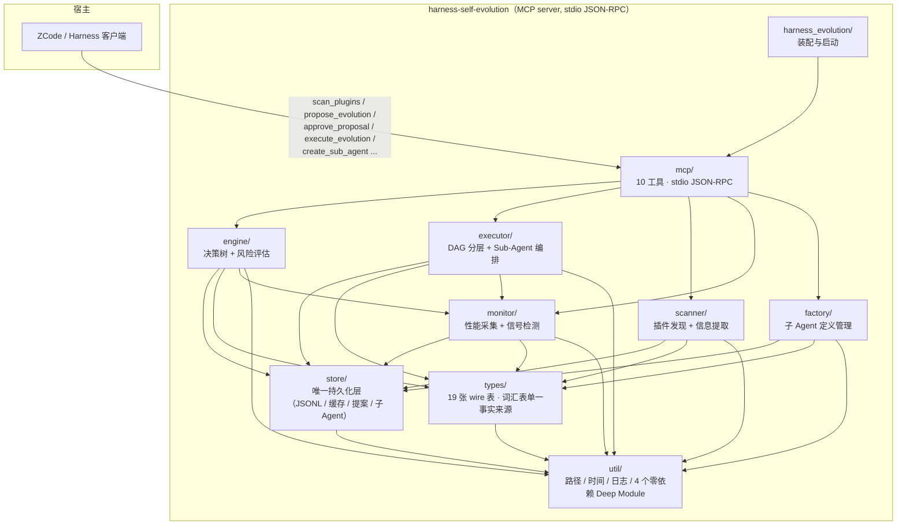
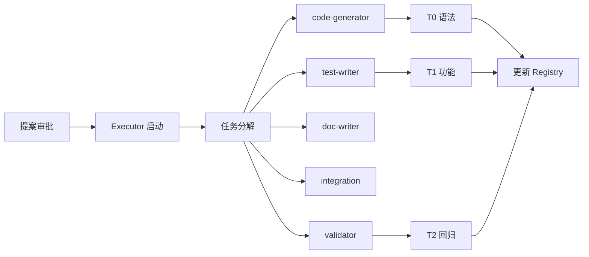

# Harness Self-Evolution Plugin

> 让 DeepSeek Harness 的插件生态持续自我进化 —— 扫描 → 监控 → 识别 → 提案 → 人工审批 → 真实升级。

[](LICENSE)
[](.zcode-plugin/plugin.json)
[](moon.mod)
[](CONTEXT.md)
[](build.ps1)
[]()

[English](#english) · [中文](#中文)

---

## 中文

### 一句话定位

挂在 DeepSeek Harness 上的自进化插件。用户全程只介入一处：看提案，点同意或不同意。

### 最新进展（v2.3.0，2026-09-08）

| 轮次 | 提交 | 关键变化 |
|------|------|---------|
| 2.3.0 | `a2381fd` | **v2.3.0 收尾**：monitor.mbt 缩 367 行（抽到 `monitor/deep_check.mbt` / `monitor/flush.mbt`），config.mbt 缩 197 行（抽到 `types/config_helpers.mbt`）；`ServerState::with_harness_config` 统一三段配置；五处版本元数据升 2.3.0 |
| 2.2.0 | `8b9970e` | **接通 `scan_targets` 配置孤岛**：`plugin.json` 的 `scan_targets` 段真正驱动扫描根，支持 `~/...` 展开，缺失/类型不符/为空都回退默认根并点名告警；新增 `ScanConfig::from_plugin_json` 纯解析函数和 8 个白盒用例 |
| 2.2.0 | `8b9970e` | 五处版本元数据一并升 2.2.0（`moon.mod` / `plugin.json` / `jsonrpc server_version` / `DESIGN.md` 镜像 / `SKILL.md` frontmatter） |
| 第六轮 | `b9392eb` | 信号缓冲有界化（`max_buffered_signals=500`，溢出丢最旧）；`num_field` 拒绝 `NaN` / `Infinity`；删除全仓零调用点的 `::at` 生产构造器 |
| 第四轮 | `cd2c525` | 4 真 bug 修复（`tdiv` floor 误用 / `generate_signature` 剥掉 plugin_id / factory 前后空 trim 不一致 / `cooldown_hours` 走裸 `to_int`） |
| 第五轮 | `b309000` | `AgentDefStore::list` 把「读不动」改告警；版本元数据补齐 2.1.0 |
| v2.1 | `0d3b0ce` | 子 Agent 工厂落地：3 个 MCP 工具管理两个作用域（plugin / user）的定义文件 |

完整门禁（`build.ps1 -Task all`）：`Total tests: 347, passed: 347, failed: 0.`，退出码 0，产物 `bin/harness-evolution.exe` 1,293,824 B，独立两跑一致。

### 特性

- **插件扫描**：解析 `plugin.json` / `SKILL.md`，评复杂度、接口清晰度、文档质量。
- **指标采集**：按调用记录延迟、成功率、Token 开销；热路径不读盘，深度检查按节流间隔。
- **信号识别**：强信号（用户纠正 / 连续失败 ≥ 3 / 指标下滑 > 20%）立即触发；中信号累积；弱信号只记录。
- **提案生成**：八类进化提案绑定 Matt Pocock 工程原则；24 小时冷却、每会话上限 3 条、重复丢弃。
- **执行验证**：状态机 `pending → approved → executing → completed`，非 `approved` 拒绝执行。
- **子 Agent 工厂（v2.1）**：3 个 MCP 工具（`create_sub_agent` / `list_sub_agents` / `delete_sub_agent`）管理两个作用域的 Markdown + YAML frontmatter 定义文件；路径 A 出厂模板、路径 B 动态管理均已上线，路径 C（OCR 触发真实派发）待平台回调。

### 架构



依赖图是**严格分层**的（`util → types → store → scanner/monitor → engine/executor/factory → mcp → harness_evolution`），由 `src/mcp/architecture_test.mbt` 的 11 条守卫（G1–G6）机器化验证；任何新增反向边、往 stdout 写日志、绕过 `store/` 持久化，都会在 `moon test` 里立刻变红。

### 安装

前置要求：

- **MoonBit 工具链**（`moon`）。
- **Windows**：Visual Studio 的 C++ 生成工具（`cl.exe`）+ Windows SDK。native 后端把 MoonBit 编译成 C 再用 MSVC 链接，`build.ps1` 会自动探测并注入 `INCLUDE` / `LIB` / `PATH`，**不需要**手工跑 `vcvars64.bat`。
- DeepSeek Harness 或 ZCode CLI。

运行时**不需要 Node.js** —— 产物是独立的 native 可执行文件。

```powershell
# 克隆（任选一）
git clone https://github.com/Across2005/harness-self-evolution-plugin.git
# 或
git clone https://www.gitlink.org.cn/Across2005/harness-self-evolution-plugin.git

cd harness-self-evolution-plugin

# 构建：check + test + build，产物复制到 bin\harness-evolution.exe
# 依赖由 moon 根据 moon.mod 里写死的精确版本自动拉取，无需单独的 install 步骤
.\build.ps1 all

# 链接到 ZCode（可选）
zcode plugin link .
```

> **为什么锁死 `async@0.20.1`**：0.21.x 开始使用 `noraise + nocancel` 效果注解语法，而当前工具链（moon 0.1.20260819）解析它会报 `[3002] Parse error, unexpected token '+'`。升级到能解析该语法的 moon 版本后方可放开约束。
>
> **关于 `moon.lock`**：本机工具链**不产生**模块根的 `moon.lock`（`moon mod tidy` 是独立插件 `moon-mod`，未安装时直接报错；`.mooncakes/.moon-lock` 实测为空）。可复现构建靠的是 `moon.mod` 里**写死的精确版本**而不是范围，并由架构守卫 G6 机器化钉住。用 `moon tree` 可随时核对实际解析结果（应为 `moonbitlang/async@0.20.1`）。

### `build.ps1` 子命令

| 命令 | 作用 |
|------|------|
| `.\build.ps1 check` | `moon check --deny-warn --target native`（零错零警才算过） |
| `.\build.ps1 test` | `moon test --target native` |
| `.\build.ps1 build` | release 构建 + 复制到 `bin\harness-evolution.exe` |
| `.\build.ps1 fmt` | `moon fmt` |
| `.\build.ps1 all` | 依次执行 check → test → build |

### 配置

配置只来自 `.zcode-plugin/plugin.json` 的 `evolution_config` 段（查找顺序：`$HARNESS_EVOLUTION_CONFIG` → `<cwd>/.zcode-plugin/plugin.json` → 内置默认值）。**`AGENTS.md` 不参与任何配置解析**。

2.2.0 起，`plugin.json` 的 **`scan_targets` 段** 真正驱动扫描根：数组里的每个路径（支持 `~/...`）替换内置的 3 个默认根；未配置/为空/类型不符时回退默认根并启动时点名告警。不存在的路径在扫描时跳过并打一行 stderr 提示。完整语义见 `CONTEXT.md` 的「配置来源」一节。

```json
{
  "scan_targets": ["~/plugins", "~/work/zcode-plugins"],
  "evolution_config": {
    "intensity": "50%",
    "auto_approve": false,
    "cooldown_hours": 24,
    "max_log_bytes": 33554432,
    "signal_thresholds": {
      "consecutive_failures": 3,
      "loop_detection": 5,
      "latency_regression": 0.2
    }
  }
}
```

字段含义（完整列表与边界见 `CONTEXT.md` 与 `DESIGN.md`）：

- `intensity`：`"100%"` 强信号或两个中信号均可触发；`"50%"` 仅强信号触发；`"0%"` 关闭所有进化检查。出厂默认 50%。
- `auto_approve`：**故意不接通**。1.0 里它是配置孤岛（写了但无消费方），2.0 起遇 `true` 显式告警并回落 `false` —— 人工审批是「自动改代码失控」的唯一闸门。
- `cooldown_hours`：同一插件两次提案的最短间隔，默认 24，下界 1。
- `max_log_bytes`：`metrics.jsonl` / `signals.jsonl` 的保留上限（字节，默认 32 MiB，下界 1 MiB），超限后自动裁到只保留最新的完整行。`proposals.jsonl`（审计事实来源）与 `execution.log` **不裁剪**。
- `signal_thresholds.*`：连续失败次数 / 循环检测次数 / 性能回归比例。

### 调用模式

本插件是 MCP 服务器，一切行为都由**工具调用**驱动：

1. **扫描**：客户端调用 `scan_plugins`（2.2.0 起按 `plugin.json` 的 `scan_targets` 段指定根）建立档案。
2. **监控**：宿主在工具调用链上经 `record_tool_call` / `record_user_feedback` 注入事件。
3. **提案**：`propose_evolution` 基于信号生成提案。
4. **执行**：`approve_proposal` → `execute_evolution`（必经人工审批）。

### MCP 工具（13 个）

| 工具 | 作用 |
|------|------|
| `scan_plugins` | 扫描所有插件（2.2.0 起按 `scan_targets` 段） |
| `get_plugin_metrics` | 获取插件性能指标 |
| `propose_evolution` | 生成进化提案（可带手动 `signals`） |
| `approve_proposal` | 批准提案（必经环节） |
| `reject_proposal` | 拒绝提案 |
| `list_proposals` | 列出所有提案 |
| `execute_evolution` | 执行已批准提案 |
| `create_sub_agent` | 创建子 Agent 定义文件（v2.1） |
| `list_sub_agents` | 列出子 Agent 定义（v2.1，可按 `scope` 过滤） |
| `delete_sub_agent` | 删除子 Agent 定义（v2.1） |
| `analyze_plugins` | 合并工具：扫描并/或获取指标（v2.3，`mode=scan/metrics/both`） |
| `evolve_plugin` | 合并工具：生成或执行提案（v2.3，`action=propose/execute`） |
| `manage_sub_agent` | 合并工具：管理子 Agent 定义（v2.3，`action=create/list/delete`） |

### 数据存储

所有数据以 JSONL / JSON 格式存储在**同一个数据根目录**下（默认 `~/.harness-evolution/v2/`，可用 `$HARNESS_EVOLUTION_HOME` 覆盖）：

```
plugin-cache.json   # 扫描缓存（每条带目录指纹：mtime + 子项数 + 子项 mtime）
metrics.jsonl       # 性能事件（monitor 写，受 max_log_bytes 约束）
signals.jsonl       # 进化信号（monitor 写 / engine 读，受 max_log_bytes 约束）
proposals.jsonl     # 进化提案（ProposalStore 唯一读写口，**不裁剪**）
execution.log       # 执行日志（executor，**不裁剪**）
agents/             # 子 Agent 定义（factory 写，scope=plugin；scope=user 写到宿主 ~/.zcode/agents/）
```

数据根目录的默认值只在 `store/paths.mbt` 一处定义，并由 `mcp/architecture_test.mbt` 的 G4 守卫机器化地防止它再次扩散（1.0 版把它散落在 4 个文件里）。

> **关于 v1 目录**：2.0 使用 `v2/` 子目录，**不做自动迁移**。若检测到 1.0 的 `~/.harness-evolution/` 存在，启动时会在 stderr 提示一行，然后原样保留。原因是 1.0 的 `plugin-cache.json` 命中条件过于宽松（只要缓存非空就直接返回，从不校验目录是否还存在），实测会被一条指向已删除临时目录的幽灵记录永久毒化 —— 丢弃重扫比迁移更安全。

### 子 Agent 协同



出厂模板随插件的 `agents/` 目录分发（frontmatter + 系统提示词，ZCode 的 agent 载体格式），宿主会自动发现加载；`create_sub_agent` / `list_sub_agents` / `delete_sub_agent` 三个工具可以增删管理这些定义。设计与研究结论见 [`docs/subagent-factory.md`](docs/subagent-factory.md)。

### 架构守卫（G1–G6）

| 守卫 | 约束 |
|------|------|
| G1 / G1b | 包依赖图与声明完全一致，且每条边严格向下（构造性无环） |
| G2 / G2b | `@stdio.stdout` 只在 `mcp/server.mbt`，`@stdio.stderr` 只在 `util/log.mbt` |
| G3 / G3b | `@fs` 的写操作只在 `store/` |
| G4 / G4b | 数据目录字面量只在 `store/paths.mbt` |
| G5 / G5b | `legacy-ts/tests/` 的 37 个 jest 用例逐条有 MoonBit 对应物 |
| G6 | `moon.mod` 只有一个外部依赖，且 native 是首选目标 |

每条守卫都做过**负向探针**验证（人为引入违规确认会变红），否则「永远通过的测试」只是装饰。

### 与 1.0（TypeScript）版对拍

1.0 的完整工程保留在 `legacy-ts/`，仍可运行：

```powershell
cd legacy-ts
npm install
npx jest          # 37 个用例
```

它是 2.0 移植正确性的客观参照：G5 守卫会解析这 37 个用例名，逐条核对 MoonBit 侧的对应测试是否仍然存在。

### 风险缓解

- **只读扫描**：Scanner 不修改任何插件代码。
- **审批强制**：所有进化必须经 `approve_proposal`。
- **状态机约束**：提案只能从 `pending → approved → executing → completed`（或被 `reject_proposal` 回到 `rejected`），非法跃迁一律拒。
- **信号缓冲有界**：`signal_buffer` 上限 500 条（`max_buffered_signals`），溢出丢最旧。
- **数值防御**：`num_field` 拒绝 `NaN` / `Infinity`，回落默认值并点名告警。
- **观测日志有界**：`metrics.jsonl` / `signals.jsonl` 受 `max_log_bytes` 约束，超限保留最新完整行。
- **手动信号需注意**：`propose_evolution` 的 `signals` 参数按设计是 medium 强度，**默认 50% 只放行 strong** —— 手动信号在出厂默认配置下不会触发提案；要把手动信号生效得把 `intensity` 设为 `"100%"`（已知缺陷第 1 条 F5）。
- **生产数据源尚未接入**：`record_tool_call` / `record_user_feedback` 在本仓库里**没有生产调用方**（1.0 也一样）。可走手动路径，但自动信号需 Harness 侧注入事件（注入点已就绪，待平台回调）。

### 文档

- [`CONTEXT.md`](CONTEXT.md) —— 设计上下文、缺陷清单、配置来源、架构守卫、Matt Pocock 原则 ↔ 进化类型映射
- [`DESIGN.md`](DESIGN.md) —— 详细设计、模块边界、调用链
- [`docs/subagent-factory.md`](docs/subagent-factory.md) —— 子 Agent 工厂的设计与研究结论
- [`legacy-ts/`](legacy-ts) —— 1.0（TypeScript）版的完整工程，作为移植正确性的客观参照

### 贡献

欢迎提交 Issue 和 Pull Request。请先读 [`CONTEXT.md`](CONTEXT.md) 的「架构不变量」与「Matt Pocock 原则」两节 —— 任何反向边、往 stdout 写日志、绕过 `store/` 持久化、引入裸配置孤岛，都会被架构守卫在 `moon test` 阶段直接拒。

### 许可证

[MIT](LICENSE)

---

## English

### What is this

A self-evolution plugin for the [DeepSeek Harness](https://github.com/deepseek-ai) ecosystem. It scans plugins, monitors performance, detects signals, drafts upgrade proposals, and (only after explicit human approval) executes the upgrade. The user touches it in exactly one place: reviewing proposals.

### Latest (v2.3.0, 2026-09-08)

- **Closed the last config island**: `plugin.json`'s `scan_targets` field now actually drives the scanner roots (with `~/...` expansion, type-checked, fall-back-with-warn on missing/malformed/empty).
- **Signal buffer bounded** (`max_buffered_signals=500`, drop-oldest on overflow).
- **Numeric config defense** (`num_field` rejects `NaN` / `Infinity`).
- **Dead `::at` constructors** swept across engine / executor / scanner.
- Plus 4 real bug fixes and 10 hardening items from the prior two review rounds (see `CONTEXT.md`).

### Quickstart

```powershell
git clone https://github.com/Across2005/harness-self-evolution-plugin.git
cd harness-self-evolution-plugin
.\build.ps1 all
```

### Documentation

- [`CONTEXT.md`](CONTEXT.md) — design context, defect ledger, config source, architecture guards
- [`DESIGN.md`](DESIGN.md) — detailed design
- [`docs/subagent-factory.md`](docs/subagent-factory.md) — sub-agent factory

### License

[MIT](LICENSE)
